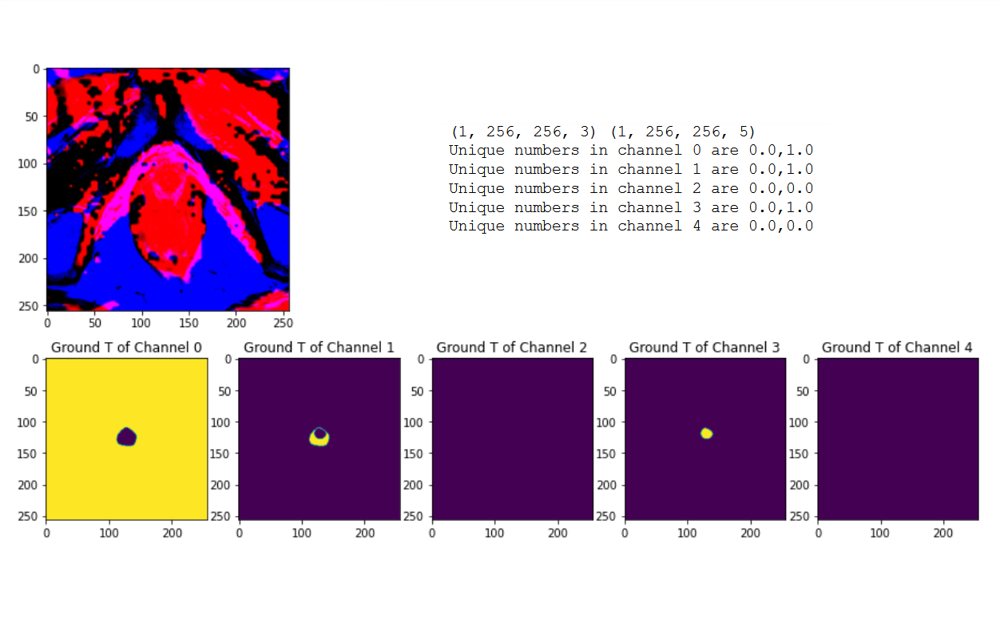

# Prostate-Segmentation
Magnetic resonance imaging (MRI) produces detailed anatomical images of the prostate and its areas. It plays a crucial role in many diagnostic applications. Automatic segmentation of prostate and prostate zones from MR images makes many diagnostic and therapeutic applications easier. In this repository, I tried to segment prostate using Pix2Pix network.

## 1. Datasets 
Two datasets (Train and Test) were created using different the **combinations of images, including T2-Weighted (T2W) images, Diffusion-Weighted Images (DWI) and Apparent Diffusion Coefficient (ADC) images**. To merge and aligne the DWI, ADC and T2W images, I used an established registration toolbox for transformation [1].

## 2. Normalization
In normalising the images, the mean value of all images is subtracted from the signal intensity of each pixel and the value obtained is divided by the standard deviation.

## 3. Data Augmentation
For the training sample, we rotated the data by 90◦ , flipped it horizontally and flipped it vertically. 

[1]: Klein, S.; Staring, M. Elastix: A toolbox for intensity-based medical image registration. IEEE Trans. Med. Imaging 2010, 29, 196–205.
[CrossRef] [PubMed]
